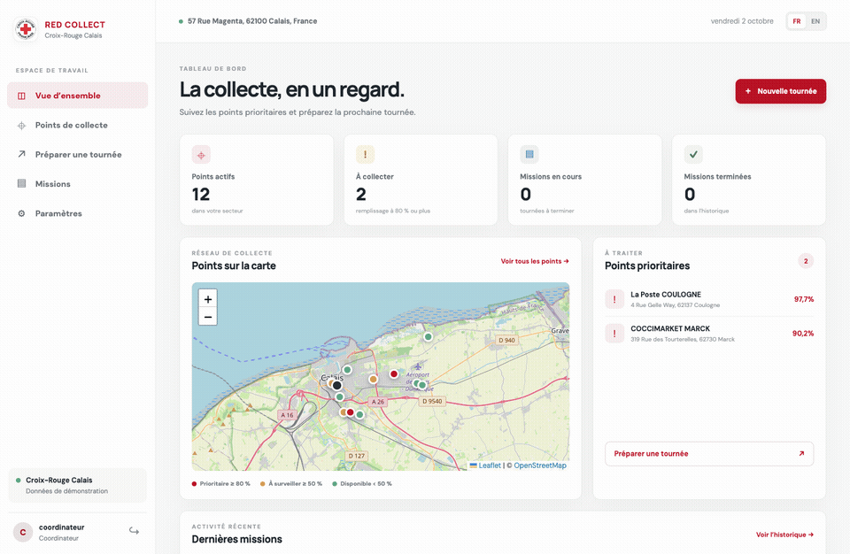
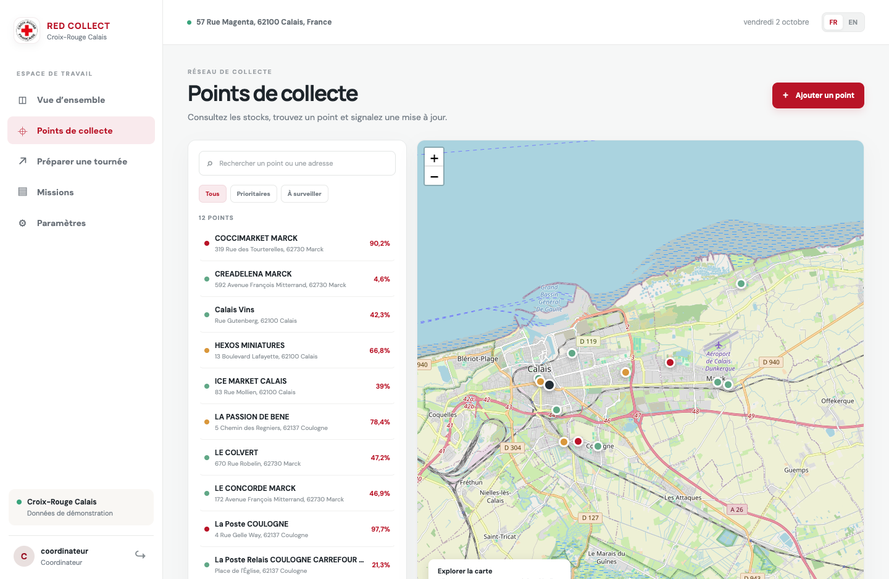
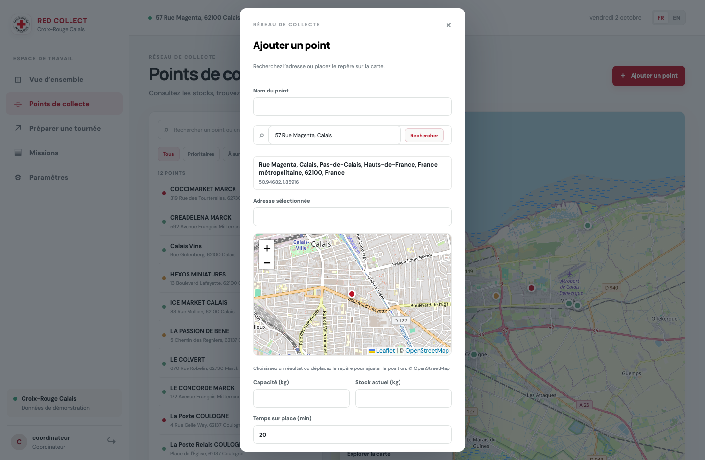
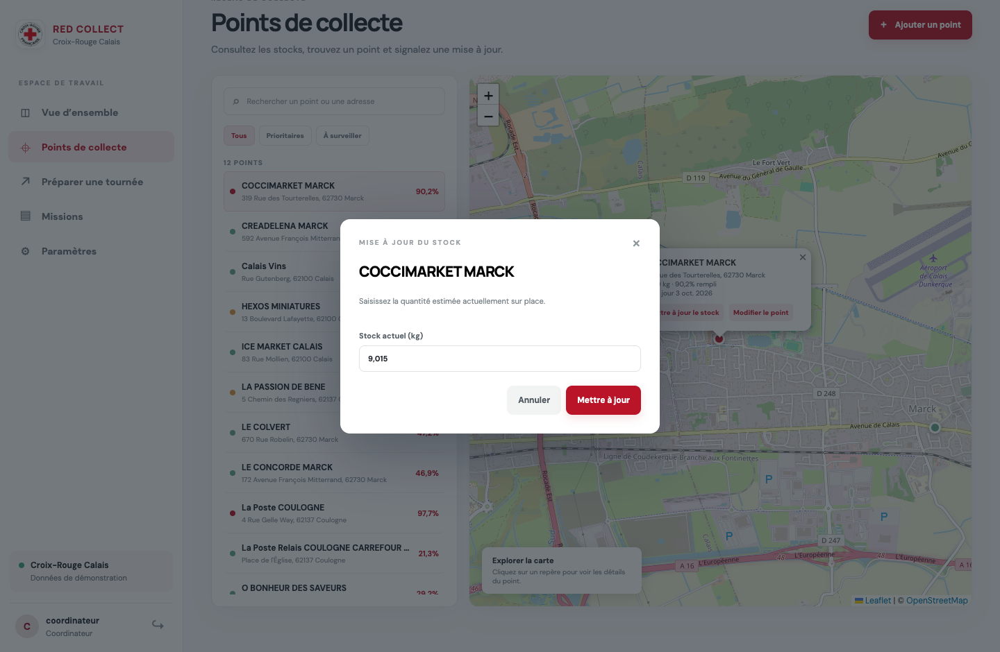
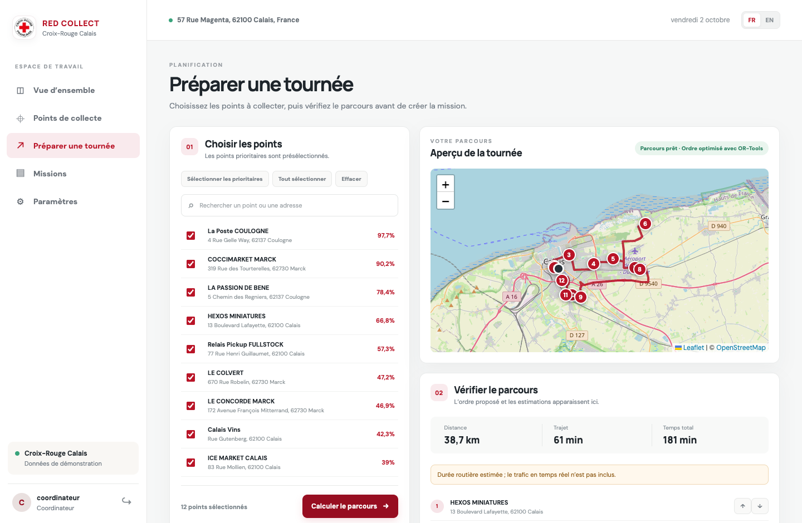
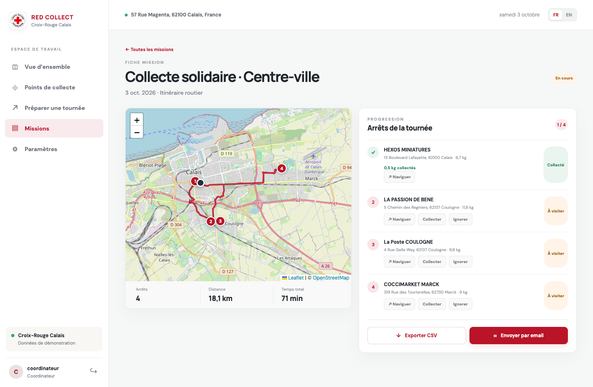
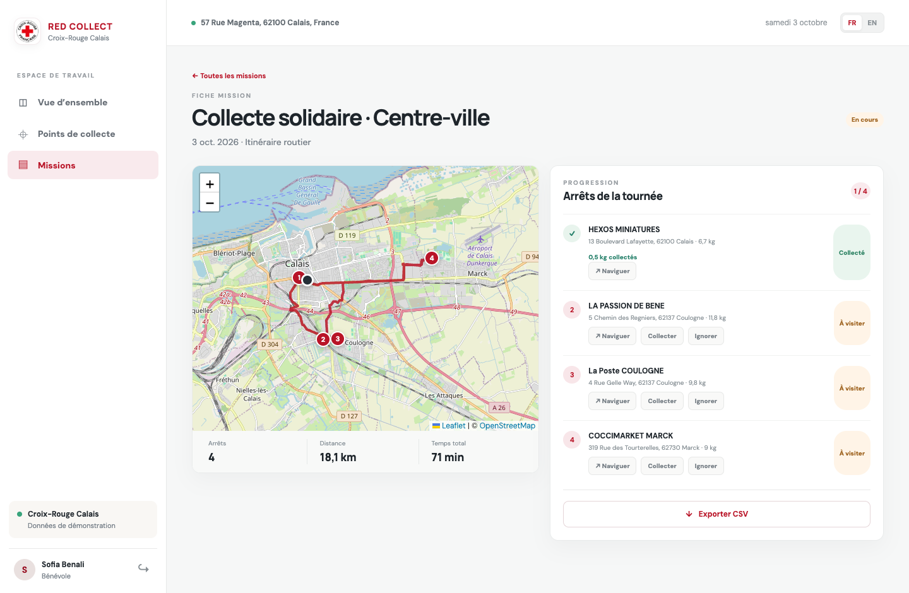
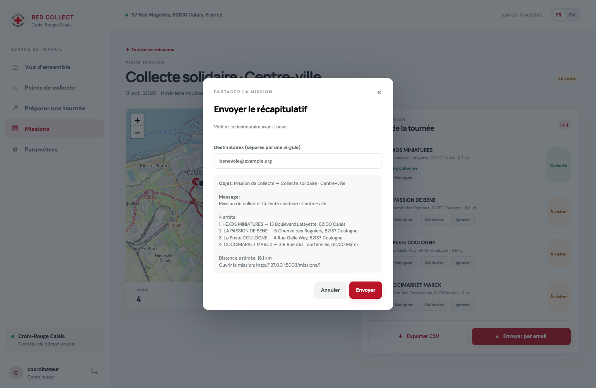
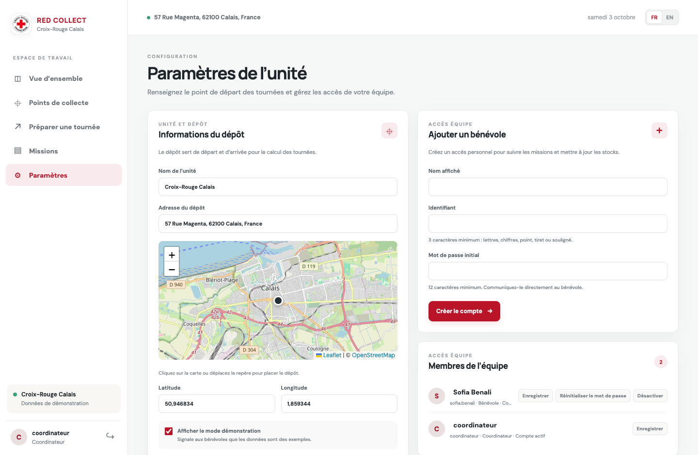
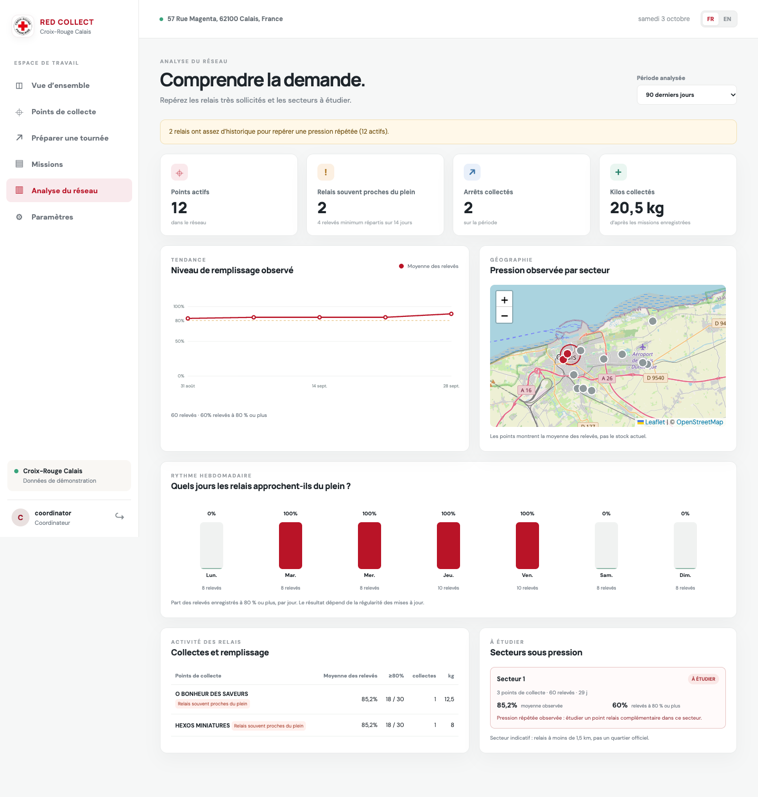

<div align="center">
  
  <h1>Organiser les dons, du relais à la tournée.</h1>
  <p><strong>RED</strong> signifie <em>Réseau d’Entraide et de Dons</em>. <strong>Collect</strong> aide les équipes à organiser les collectes.</p>
  <p>Un outil open source de coordination des dons, pensé pour les associations et né à Calais.</p>
  <p>
    
    
    <a href="LICENSE"></a>
  </p>
  <p><a href="#francais">Lire en français</a> · <a href="#english">Read in English</a> · <a href="docs/EVOLUTIONS.md">Architecture et feuille de route</a></p>
</div>

<p align="center">
  
</p>

<p align="center"><sub>Parcours silencieux sur une base de démonstration · Données fictives · Aucun email envoyé</sub></p>

<div align="center">
  <a href="#histoire">Notre point de départ</a> ·
  <a href="#apercu">Voir l’application</a> ·
  <a href="#fonctionnalites">Fonctionnalités</a> ·
  <a href="#installation">Installation locale</a> ·
  <a href="#contribuer">Contribuer</a>
</div>

---

<a id="francais"></a>

## Français

### En bref

**RED** signifie **Réseau d’Entraide et de Dons** ; **Collect** décrit le travail d’organisation des collectes. Red Collect est un outil de terrain open source qui réunit points relais, stocks, tournées et missions bénévoles dans une même interface. Il s’adresse aux équipes associatives qui ont besoin d’un suivi lisible sans gérer des fichiers CSV ni saisir des coordonnées GPS.

<a id="histoire"></a>

### Origine du projet

À Calais, des personnes exilées qui tentent de traverser la Manche se retrouvent parfois dans l’eau et sont secourues. Après une hospitalisation, certaines ont besoin de vêtements propres pour retrouver un minimum de dignité. Les associations qui les accompagnent font face à des besoins croissants alors que les vêtements disponibles restent insuffisants. Red Collect part de ce besoin concret : mieux organiser les dons, les points de collecte et les tournées pour aider les équipes à répondre au bon moment.

Le logiciel est pensé pour la collecte de dons au sens large, et non pour le seul textile. Il est publié en open source afin que d’autres associations puissent l’essayer, l’adapter à leur organisation et contribuer à son évolution. Il s’agit d’un projet indépendant, pas d’un service officiel de la Croix-Rouge.

<p align="center">
  
</p>
<p align="center"><em>Illustration générée pour présenter le besoin auquel le projet souhaite répondre. Elle ne représente pas une intervention réelle ni une photographie documentaire.</em></p>

Il n’y a pas d’instance publique hébergée : l’application se lance localement depuis ce dépôt. Les adresses, stocks et missions montrés dans les captures sont des données d’exemple.

<a id="apercu"></a>

### Aperçu de l’application

La boucle silencieuse ci-dessus suit le parcours principal. Les captures individuelles permettent d’examiner les écrans en détail :

| Tableau de bord | Points et carte | Ajout par adresse |
|:--:|:--:|:--:|
|  |  |  |

| Mise à jour du stock | Planification et tournée | Suivi d’une mission |
|:--:|:--:|:--:|
|  |  |  |

| Vue bénévole | Partage par email | Équipe et dépôt |
|:--:|:--:|:--:|
|  |  |  |

| Analyse du réseau |
|:--:|
|  |

[Voir aussi le tableau de bord en anglais](assets/screenshots/06-dashboard-en.png), [la liste des missions](assets/screenshots/11-missions-list.png) et [l’écran de préparation d’une tournée](assets/screenshots/03-planner.png).

<a id="fonctionnalites"></a>

### Fonctionnalités

| Fonction | Coordinateur | Bénévole |
|:--|:--:|:--:|
| Consulter le tableau de bord, la carte, les points et les missions | Oui | Oui |
| Mettre à jour le stock d’un point et enregistrer les kilos collectés | Oui | Oui |
| Suivre le stock par catégorie de don et ventiler une collecte par catégorie | Oui | Oui |
| Ajouter ou modifier un point, ses capacités et son temps de collecte | Oui | — |
| Chercher une adresse et ajuster le repère directement sur la carte | Oui | — |
| Préparer et créer une tournée, choisir et réordonner les arrêts | Oui | — |
| Affecter une mission à un bénévole | Oui | — |
| Marquer un arrêt collecté/ignoré sur une mission affectée | Oui | Oui* |
| Analyser les tendances de remplissage, les jours de pression et les zones à étudier | Oui | — |
| Créer un compte coordinateur et choisir une unité locale | Oui | — |
| Gérer les comptes bénévoles, le dépôt et les paramètres de démonstration | Oui | — |
| Modifier le nom, l’email et le téléphone du profil | Oui | Oui |
| Exporter la mission en CSV et préparer/envoyer un récapitulatif par email | Oui | Export CSV |

\* Un bénévole peut mettre à jour uniquement les missions affectées à son compte. Les utilisateurs, les points, les missions, le dépôt et les analyses sont limités à l’unité locale du compte. Les liens de navigation ouvrent Google Maps sur l’arrêt sélectionné; le guidage GPS ne se fait pas dans Red Collect.

### Utilisation

1. Le coordinateur vérifie le dépôt et la carte dans **Paramètres**.
2. Dans **Points de collecte**, il filtre les relais prioritaires, met à jour les stocks ou ajoute un relais par adresse. Il peut sélectionner un résultat de recherche puis déplacer le repère pour ajuster l’emplacement.
3. Lors d’une mise à jour, l’équipe répartit le stock estimé entre les catégories : vêtements, chaussures, hygiène, bébé et puériculture, linge de maison, alimentation, autres dons ou non classé. La somme reste plafonnée par la capacité du relais.
4. Dans **Préparer une tournée**, le coordinateur sélectionne les relais, calcule et vérifie le parcours, réordonne les arrêts si nécessaire, nomme la mission et l’attribue à un bénévole.
5. Le bénévole ouvre **Missions**, consulte sa tournée et lance la navigation vers un arrêt. Après la visite, il ventile les quantités récupérées par catégorie ou marque l’arrêt comme ignoré. La validation contrôle que le total correspond aux quantités ventilées et ne dépasse pas le stock déclaré pour chaque catégorie; le stock et l’historique sont mis à jour.
6. Le coordinateur consulte l’avancement, exporte le CSV ou vérifie le récapitulatif email avant de l’envoyer.
7. Dans **Analyse du réseau**, il compare les relevés sur 30, 90, 180 ou 365 jours, les jours où les points approchent souvent 80 %, le stock disponible par catégorie et les kilos collectés par catégorie sur la période choisie.

Les stocks et les collectes sont exprimés en kilogrammes. Le stock initial d’un nouveau point est classé **Non classé** jusqu’à sa ventilation. Lorsqu’une ancienne base ne comportait que des stocks agrégés, la migration les conserve dans cette même catégorie plutôt que de deviner leur composition. Les historiques catégorisés de collecte ne remontent pas avant l’activation de cette fonction.

Le bouton d’envoi email n’envoie rien sans une configuration SMTP valide. Les captures montrent uniquement l’aperçu : aucun email de démonstration n’a été envoyé.

L’analyse est déterministe : elle agrège les relevés de stock et les arrêts de mission terminés, puis applique des seuils documentés. Elle ne prédit pas la demande et n’utilise pas de modèle opaque. Un secteur est proposé pour examen seulement après au moins 6 relevés répartis sur 14 jours ou plus, avec une moyenne d’au moins 70 % et au moins la moitié des relevés à 80 % ou plus. Pour qualifier une pression répétée, un point doit aussi avoir au moins 4 relevés répartis sur 14 jours, avec une moyenne d’au moins 70 % et au moins la moitié des relevés à 80 % ou plus. Les zones regroupent les points proches (moins de 1,5 km) et ne correspondent pas à des quartiers officiels. Ces indicateurs orientent l’examen par l’équipe; ils ne remplacent ni une visite de terrain ni une décision d’implantation. La capture analytique utilise une série temporelle synthétique pour illustrer l’écran; elle n’ajoute pas ces données à la base locale.

Le tableau de bord présente également le stock courant par catégorie et le poids des collectes catégorisées sur la période analysée. Il compare descriptivement cette période à la période précédente de même durée pour trois valeurs : kilos collectés, arrêts de collecte terminés et part des relevés de stock à 80 % ou plus. Une évolution observée ne prouve pas que l’application ou l’ajout d’un point relais en soit la cause. Les collectes catégorisées ne sont disponibles que depuis l’activation de cette fonction; l’absence de données antérieures n’est pas interprétée comme zéro.

### Évaluer les effets sans les inventer

Red Collect aide à rendre visibles les stocks enregistrés, les collectes réalisées et les moments de forte sollicitation. Le projet n’a pas encore de référence avant/après vérifiée : il ne permet donc pas d’affirmer qu’il a déjà augmenté les dons, réduit les tournées urgentes ou répondu à l’évolution des besoins. Pour mesurer ces effets lors d’un pilote, une association pourra comparer des périodes équivalentes et consigner le poids collecté, les visites, les arrêts urgents, les ruptures de stock et les dons refusés ou non satisfaits. Les résultats devront préciser la période, la couverture des relevés et les changements d’organisation intervenus.

<a id="installation"></a>

### Installation et lancement local

Python 3.11 ou plus récent est nécessaire. Docker est facultatif pour démarrer l’interface; sans le service de routage, les distances sont calculées à vol d’oiseau et cette limite est signalée dans l’application.

```bash
git clone https://github.com/mouad-abaaqil/Croix-Rouge.git
cd Croix-Rouge
python3 -m venv .venv
source .venv/bin/activate
pip install -r requirements.txt
cp .env.example .env
```

Créez une clé secrète locale, puis initialisez la base et le compte coordinateur :

```bash
python3 - <<'PY'
from pathlib import Path
import secrets
p = Path('.env')
p.write_text(p.read_text().replace('APP_SECRET_KEY=', f'APP_SECRET_KEY={secrets.token_hex(32)}'))
PY
python3 webapp.py init
python3 webapp.py
```

`init` demande un identifiant et un mot de passe d’au moins 12 caractères. Il charge les points d’exemple à la première initialisation. Vous pouvez aussi ouvrir la page d’accueil et créer un compte coordinateur, choisir une unité locale, puis gérer les bénévoles de cette unité. Les bénévoles sont automatiquement rattachés à l’unité du coordinateur. Ouvrez [http://127.0.0.1:5000](http://127.0.0.1:5000). Si le port est occupé, lancez `PORT=5002 python3 webapp.py` puis ouvrez [http://127.0.0.1:5002](http://127.0.0.1:5002).

Coordinateurs et bénévoles peuvent modifier leur nom, adresse email et téléphone dans **Mon profil**. Le coordinateur peut également mettre à jour les coordonnées des bénévoles de son unité.

Le menu contient 576 pages « unité locale » indexées par le sitemap officiel au 3 octobre 2026. La liste versionnée est `data/local_units.json`; ses libellés sont dérivés des URLs et les fiches officielles restent la référence. Pour l’actualiser, lancez `python3 scripts/update_local_units.py` manuellement; le script ne tourne pas au démarrage. Le site officiel n’affiche pas clairement de licence ouverte pour ces pages : les sources et la date de collecte sont conservées, et les utilisateurs doivent vérifier les conditions de réutilisation avant de redistribuer l’annuaire.

Le mot de passe n’est jamais affiché ni stocké en clair. Pour réinitialiser celui d’un coordinateur local, arrêtez l’application, lancez `python3 webapp.py reset-password NOM_DU_COORDINATEUR`, puis saisissez un nouveau mot de passe d’au moins 12 caractères.

### Activer les trajets routiers

Le service OSRM facultatif calcule des distances, durées et tracés à partir du réseau routier. Docker est nécessaire pour cette option. Ajoutez dans `.env` :

```dotenv
ROUTING_URL=http://127.0.0.1:5001
```

Puis préparez la carte régionale et démarrez le service :

```bash
bash scripts/setup_routing.sh
docker compose up -d routing
```

Le téléchargement de la carte fait environ 230 Mo et varie selon la source. Le graphe préparé occupe plusieurs fois cette taille et son pré-calcul peut demander environ 2 Gio de mémoire. Les fichiers restent dans `routing-data/`; le pré-calcul n’est pas répété à chaque lancement. Redémarrez ensuite l’application. OSRM n’intègre pas le trafic en temps réel. OR-Tools Guided Local Search ordonne les arrêts à partir des durées routières; les petites tournées utilisent une optimisation plus légère. Si OSRM est indisponible, l’application revient à une estimation à vol d’oiseau et le signale.

### Configuration disponible

Les valeurs se configurent dans le fichier local `.env` (ignoré par Git). Les identifiants SMTP sont facultatifs; ne les ajoutez jamais au dépôt.

| Variable | Usage |
|:--|:--|
| `APP_SECRET_KEY` | Clé aléatoire utilisée pour signer les sessions |
| `APP_HTTPS` | Mettre à `1` derrière un proxy HTTPS afin d’activer le cookie sécurisé |
| `DATABASE_PATH` | Chemin de la base SQLite; par défaut `instance/redcollect.sqlite3` |
| `ROUTING_URL` | URL du service OSRM; laisser vide pour le calcul de secours |
| `ROUTE_SOLVER_SECONDS` | Temps maximal de recherche OR-Tools, plafonné par l’application |
| `GEOCODER_URL` | Service de recherche d’adresses; Nominatim est utilisé par défaut |
| `SMTP_SERVER`, `SMTP_PORT`, `SMTP_USERNAME`, `SMTP_PASSWORD`, `SENDER_EMAIL` | Envoi facultatif des récapitulatifs de mission |

### Cartes, services externes et données

Les tuiles de carte et la recherche d’adresse dépendent d’OpenStreetMap. Une recherche d’adresse est déclenchée par l’utilisateur, limitée à une requête par seconde et mise en cache localement. Avec le service Nominatim public, l’adresse recherchée est envoyée à ce service; cette instance est destinée à un usage modéré. Consultez sa [politique d’utilisation](https://operations.osmfoundation.org/policies/nominatim/) et la [politique des tuiles OpenStreetMap](https://operations.osmfoundation.org/policies/tiles/) avant tout usage. L’application affiche l’attribution OpenStreetMap.

Les points fournis sont des exemples de Calais. Vérifiez et remplacez les adresses, les capacités et les niveaux de stock avant tout usage opérationnel. La base SQLite contient les comptes, points, mises à jour de stock, paramètres et missions de l’installation.

### Limites actuelles

- Aucune instance publique ni aucun compte de démonstration hébergé.
- Pas de trafic routier en direct; les itinéraires sont des estimations.
- Pas de GPS intégré : la navigation ouvre un service externe.
- Les mots de passe des bénévoles sont créés ou réinitialisés par un coordinateur; l’application ne propose pas encore de changement de mot de passe personnel.
- Le journal des stocks est enregistré, mais l’interface ne présente pas encore son historique complet.
- L’analyse de zone ne connaît que les relais déjà enregistrés et leurs relevés. Elle ne mesure pas la population, les dons non déposés, les refus ni les secteurs sans aucun relais.
- Le découpage en secteurs est calculé par proximité entre relais; il ne représente pas des limites de quartier.
- La recherche d’adresse, les tuiles de carte et l’email dépendent des services externes indiqués plus haut.

Pour l’architecture et les évolutions possibles, voir [docs/EVOLUTIONS.md](docs/EVOLUTIONS.md).

<a id="contribuer"></a>

### Contribuer et tester

```bash
python3 -m unittest discover -s tests -v
node --check static/js/app.js
```

Pour comprendre l’application, utilisez la carte du dépôt des fonctionnalités dans [docs/EVOLUTIONS.md](docs/EVOLUTIONS.md), puis lancez les tests avant toute modification.

### Licence et identité

Projet distribué sous licence [MIT](LICENSE). Les marques et emblèmes de la Croix-Rouge restent la propriété de leurs détenteurs respectifs. Ce dépôt est un projet open source indépendant; ne le présentez pas comme un service officiellement exploité par la Croix-Rouge.

---

<a id="english"></a>

## English

### Overview

**RED** stands for **Réseau d’Entraide et de Dons** (Community Network for Donations); **Collect** describes the collection work the software helps organize. Red Collect is an open-source tool that brings relay points, stock, routes and volunteer missions into one interface. It is intended for association teams that need a clear workflow without maintaining spreadsheets or entering GPS coordinates. The interface is available in French and English. There is no hosted public instance; run the app locally from this repository. Screenshots and the silent walkthrough use sample data.

### Why this project

In Calais, people seeking safety who attempt to cross the Channel sometimes end up in the water and are rescued. After a hospital stay, some need clean clothes to regain a basic measure of dignity. The associations supporting them face growing needs while clothing supplies remain insufficient. Red Collect starts from this practical need: help teams organize donations, collection points and routes so they can respond at the right time.

The project is intended for donations broadly, not clothing alone. It is open source so other associations can try it, adapt it to their work and contribute improvements. Red Collect is an independent project, not an official service operated by the Red Cross.

<p align="center">
  
</p>
<p align="center"><em>Generated illustration to introduce the need behind the project. It does not depict a real intervention or serve as documentary evidence.</em></p>

### Results and demonstrations

The silent walkthrough and screen captures above use sample data to show the dashboard, map, address search, stock updates, route planning, missions, team settings and network analysis. They demonstrate the software workflow; they are not evidence that the project has already increased donations or reduced urgent trips. See the [before-and-after measurement notes](#measuring-effects-without-overstating-them) before interpreting operational outcomes.

### Features

| Feature | Coordinator | Volunteer |
|:--|:--:|:--:|
| View the dashboard, map, collection points and missions | Yes | Yes |
| Update stock by donation category and record collections by category | Yes | Yes |
| Add or edit points, capacities and estimated pickup time | Yes | — |
| Search an address and adjust its map marker | Yes | — |
| Plan a route, reorder stops, create and assign a mission | Yes | — |
| Manage volunteer accounts and depot settings | Yes | — |
| Create a coordinator account and select a local unit | Yes | — |
| Edit personal name, email and phone | Yes | Yes |
| Update stops on a mission assigned to them | Yes | Yes* |
| Export a mission as CSV and preview/send its email summary | Yes | CSV export |

\* Volunteers can update only missions assigned to their account. Accounts, points, missions, depots and analyses are scoped to the selected local unit. Stop navigation opens Google Maps; Red Collect does not provide turn-by-turn GPS navigation.

### Installation and use

Use Python 3.11 or newer:

```bash
git clone https://github.com/mouad-abaaqil/Croix-Rouge.git
cd Croix-Rouge
python3 -m venv .venv
source .venv/bin/activate
pip install -r requirements.txt
cp .env.example .env
```

Set a random `APP_SECRET_KEY` in `.env`, then run `python3 webapp.py init` and `python3 webapp.py`. Initialization creates the coordinator account and imports sample points into a new database. Open [http://127.0.0.1:5000](http://127.0.0.1:5000). See the French section above for the exact secret-generation command and optional OSRM setup.

Passwords are never displayed or stored in plaintext. Coordinators can register from the home page, select a local unit and create volunteer accounts in that unit. Both roles can edit their name, email and phone from **My profile**. The 576-entry unit index comes from the official sitemap and can be refreshed manually with `python3 scripts/update_local_units.py`; its labels are derived from source URLs. Verify reuse terms before redistributing this directory, since the official pages do not clearly state an open-data license. To reset a local coordinator password, stop the app and run `python3 webapp.py reset-password COORDINATOR_USERNAME`, then enter a new password of at least 12 characters.

### Categories, analytics, maps and routing

The coordinator-only **Network analysis** page uses deterministic aggregation of recorded stock observations and completed mission stops; it does not use an opaque predictive model. It compares 30, 90, 180 or 365 days of recorded stock observations, completed visits and collected weight. It shows weekly fill trends, the share of recorded readings above 80% by weekday, a map of observed relay pressure and nearby areas to review. It also shows current stock and collected weight by donation category, plus a descriptive comparison of the selected period with the previous period of equal length. The comparison covers collected weight, completed collection stops and the share of stock readings at 80% or above. A change does not establish that the software or a new relay caused it. The documented thresholds and data limitations described in the French section apply.

Donation stock can be recorded under **Clothing, Shoes, Hygiene, Baby supplies, Household linen, Food, Other donations** or **Unclassified**. A new point’s starting stock is stored as **Unclassified** until someone allocates it. Volunteers record collected quantities by category when completing a mission stop. The sum is checked against the relay’s capacity; a collection breakdown must match the total and cannot exceed the recorded stock in a category. All quantities are in kilograms. When an older database has only aggregate stock, migration preserves it as **Unclassified** rather than guessing its contents. Category-level collection history only exists from when this feature was enabled.

### Measuring effects without overstating them

Red Collect makes recorded stock, completed collections and periods of high pressure easier to see. The project does not yet have a verified before-and-after baseline, so it cannot claim to have increased donations, reduced urgent tours or met changing needs. An association piloting the software can compare equivalent periods and record collected weight, visits, urgent stops, stockouts, and donations turned away or left unmet. Any reported result should state the period, observation coverage and organizational changes that occurred.

Road routing is optional and uses a local OSRM service with OpenStreetMap data. OR-Tools Guided Local Search optimizes larger tours using OSRM travel times. If OSRM is unavailable, the app labels a straight-line fallback estimate. No live traffic is used. Address search and map tiles use OpenStreetMap services; review their usage policies before running a busy or public instance. Email summaries require SMTP configuration. Preview the message before sending; screenshots never send email.

The sample Calais points are for demonstration only. Verify or replace them before operational use. Current limitations include no hosted demo, no built-in GPS navigation, no volunteer password-change flow, and no stock-history screen.

For setup details, tests, architecture, and a suggested roadmap for future contributions, see the French guide and [docs/EVOLUTIONS.md](docs/EVOLUTIONS.md). The project is distributed under the [MIT License](LICENSE).
