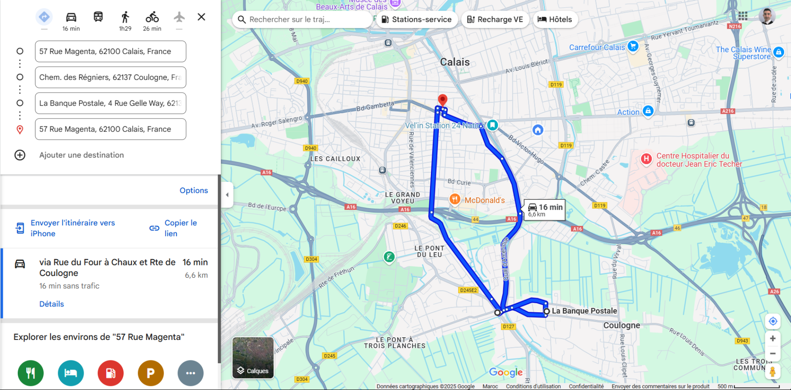
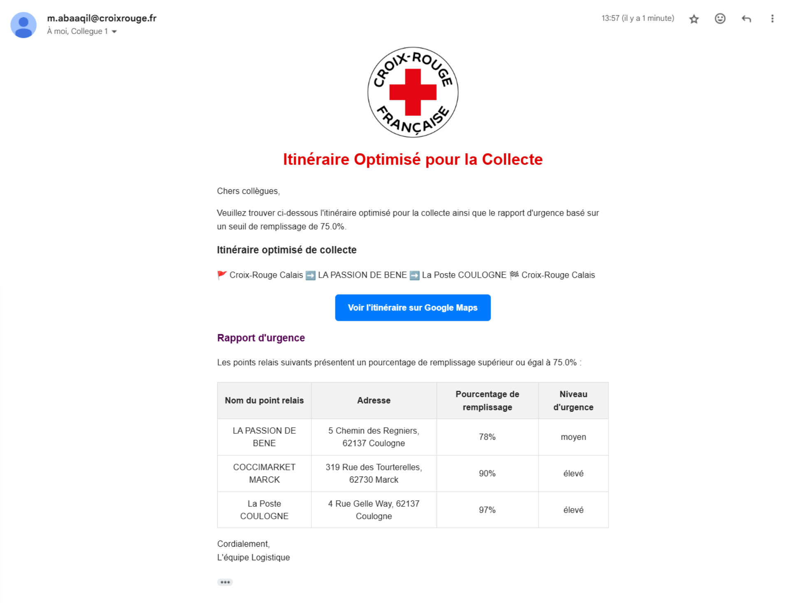

# 🚀  Optimisation de la Collecte des Dons - Croix-Rouge

<p align="center">
  
</p>

## 🌍  Introduction

Les gens veulent faire de bonnes actions, mais ils ne savent pas toujours comment s’y prendre. En me baladant à Calais, j’ai souvent vu de gros sacs en plastique remplis de vêtements laissés dans la rue. Malheureusement, à cause de la pluie et des intempéries, ces dons finissent par ne plus être utilisables.

C’est pourquoi j’ai eu une idée : pourquoi attendre que les gens viennent chez nous pour donner leurs dons, alors que nous pourrions aller vers eux ? Bien sûr, il ne s’agit pas de frapper à chaque porte, mais plutôt de collaborer avec les points relais, qui sont stratégiquement choisis par de grandes entreprises après des études approfondies.

Nous pouvons exploiter cette infrastructure existante à des fins humanitaires. En tant qu’ingénieur et bénévole à la Croix-Rouge, je me suis dit : pourquoi ne pas utiliser mes compétences techniques pour aller au-delà du simple tri des dons et de la sensibilisation ? Ce projet a donc été conçu pour optimiser la collecte des vêtements et maximiser l’impact de notre action solidaire.

---

## 🚀  Fonctionnalités

✅  **Optimisation de l'itinéraire de collecte** en fonction des points relais ayant un taux de remplissage élevé.
✅  **Génération d’un lien Google Maps** pour une navigation simplifiée.
✅  **Envoi automatique d’un email** aux bénévoles avec l’itinéraire optimisé et le niveau d’urgence de chaque point relais.
✅  **Visualisation des urgences** en fonction du seuil de remplissage défini.

---

## 📸  Exemples

### 🗺️  **Itinéraire optimisé**
Voici un exemple d’itinéraire calculé par le système :

<p align="center">
  
</p>

### 📩  **Email de mission**
Un email est envoyé aux bénévoles avec les détails de la collecte :

<p align="center">
  
</p>

---

## 🏗️  Installation

### 1️⃣  **Cloner le projet**
```bash
git clone https://github.com/votre-repo.git
cd votre-repo
```

### 2️⃣  **Installer les dépendances**
Assurez-vous d'avoir Python installé, puis exécutez :
```bash
pip install -r requirements.txt
```

### 3️⃣  **Configurer les variables d’environnement**
Créez un fichier `.env` et ajoutez-y les informations suivantes :
```
SENDER_EMAIL=votre_email@example.com
SMTP_SERVER=smtp.example.com
SMTP_PORT=587
SMTP_USERNAME=votre_email@example.com
SMTP_PASSWORD=votre_mot_de_passe
RECEIVER_EMAILS=collegue1@example.com,collegue2@example.com
```

### 4️⃣  **Lancer le menu de l’application**
```bash
python app.py
```

---

## 📝  Utilisation

L’application propose un menu interactif permettant d’exécuter les différentes étapes :

1. **Générer le fichier CSV initial** (génère la liste des points de collecte)
2. **Mettre à jour les données** (modification des stocks)
3. **Sélectionner les meilleurs points relais** (en fonction de leur taux de remplissage)
4. **Calculer l’itinéraire optimisé** (trouver le meilleur parcours de collecte)
5. **Générer un lien Google Maps** (facilite la navigation)
6. **Envoyer l’email de mission** (transmet toutes les informations aux bénévoles)

---

## 🔥  Améliorations futures

- **Extension du projet** pour inclure non seulement les vêtements, mais aussi d'autres types de dons comme les **produits alimentaires**, avec une gestion spécifique des **dates de péremption** pour optimiser la collecte et la distribution.  
- **Intégration d’un tableau de bord interactif** permettant de visualiser en temps réel les niveaux de stocks, les itinéraires et les besoins de collecte.  
- **Ajout de notifications intelligentes** pour alerter les bénévoles en cas d’urgence ou de collecte imminente.  
- **Optimisation des trajets** en prenant en compte **le trafic en temps réel**, les conditions météorologiques et d’autres facteurs logistiques.  
- **Automatisation avancée** avec **prédiction des besoins** en fonction des données historiques et de la saisonnalité des dons.  


---

## 🤝  Contribuer

Les contributions sont les bienvenues !

1. **Forkez le projet** 📌
2. **Créez une branche** (`git checkout -b feature-ma-modification`)
3. **Commitez vos changements** (`git commit -m "Ajout d'une fonctionnalité"`)
4. **Poussez la branche** (`git push origin feature-ma-modification`)
5. **Ouvrez une Pull Request** ✅

---

## 📜  Licence

Ce projet est sous licence MIT - voir le fichier [LICENSE](LICENSE) pour plus d’informations.

---

## 📬  Contact

Si vous avez des questions, vous pouvez me contacter à [abaaqilmouad@gmail.com](mailto:abaaqilmouad@gmail.com).

